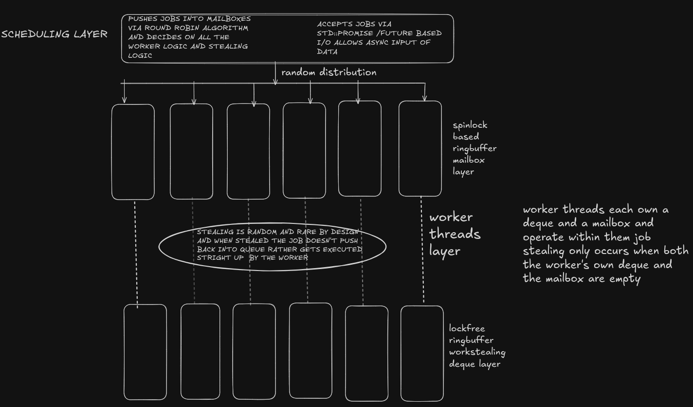

# Chronos

Chronos is a **low-latency C++ job scheduler** designed for predictable performance, minimal contention, and high-throughput I/O integration.

It employs a **hybrid queuing architecture**:
1. **Work-Stealing Deque (LIFO):** A lock-free ring buffer for thread-local task recursion.
2. **Injection Mailbox (FIFO):** A high-performance MPSC (Multi-Producer Single-Consumer) queue for external task injection from the API or I/O Reactor.

The project focuses on **correctness, cache locality, and explicit concurrency control**, strictly avoiding dynamic allocation and global contention on the scheduling hot path.

For detailed validation and performance benchmarks, please refer to [TEST_RESULTS.md](TEST_RESULTS.md).

---

### Architecture Diagram



## Design Goals

* **Predictable Latency:** Wait-free execution for workers consuming their own queues.
* **Cache Locality:** Per-thread ownership of queues with `alignas(64)` to prevent false sharing.
* **MPSC/SPSC Hybrid:** Optimized injection paths (Spinlock) vs. execution paths (Lock-Free/Wait-Free).
* **No Hot-Path Allocations:** All queue memory is pre-allocated at startup.
* **Correctness:** Validated under AddressSanitizer (ASAN) and stress tests.

---

## Current Status: Compute Layer Complete

Chronos has reached **v0.1**. The Scheduling Runtime is fully functional, capable of executing heavy parallel workloads with near-perfect linear scaling and handling adversarial submission patterns via randomized load balancing.

### Implemented Components

#### 1. The Scheduler (Orchestrator)
* **Algorithm:** **Randomized Work Stealing**.
    * Replaces deterministic Round-Robin to prevent "convoy effects" during patterned task injection.
    * Statistically ensures uniform load distribution across workers.
* **Topology:** Maps 1 Worker per Thread.

#### 2. Lock-Free Work-Stealing Deque (Chase–Lev)
* **Role:** Stores thread-local sub-tasks (recursion).
* **Semantics:** LIFO (Last-In-First-Out) for the owner; FIFO (First-In-First-Out) for thieves.
* **Synchronization:**
  * Owner: **Wait-Free** (atomic loads/stores) for push/pop.
  * Thieves: **Lock-Free** (CAS loop) to steal tasks.
* **Conflict Resolution:** Handles the "single-item race" using `compare_exchange_strong`.

#### 3. MPSC Injection Mailbox
* **Role:** Buffers tasks coming from external sources.
* **Semantics:** Strict FIFO (First-In-First-Out).
* **Synchronization:**
  * **Push (Producers):** Uses a lightweight `atomic_flag` **Spinlock**.
  * **Pop (Worker):** **Wait-Free**.
* **Safety:** Fully immune to "Phantom Reads" via strict `acquire`/`release` ordering.

---

## Planned Architecture

Chronos is structured in layers:

### 1. The Worker (Execution Engine) [DONE]
* Owns 1 `Deque` (Private) and 1 `Mailbox` (Public).
* **Priority Rule:** 1. Process Local Deque (Hot Cache) -> 2. Process Mailbox (External Input) -> 3. Steal from others.

### 2. The I/O Layer (Upcoming)
* **Epoll Reactor:** A dedicated thread for non-blocking network I/O.
* **Future/Promise:** A compatibility layer to allow `std::future` based task submission for higher-level logic.

---

## Build & Development

Chronos targets **C++20** and uses CMake.

### Build Instructions
```bash
mkdir build && cd build
# Release mode is recommended for performance testing
cmake -DCMAKE_BUILD_TYPE=Release ..
make
Running Tests
Bash

# Data Structures
./test_deque_single
./test_mailbox_mpsc

# Scheduling Runtime
./test_compute_layer   # Throughput
./test_compute_heavy   # CPU Efficiency
./test_compute_mix     # Load Balancing