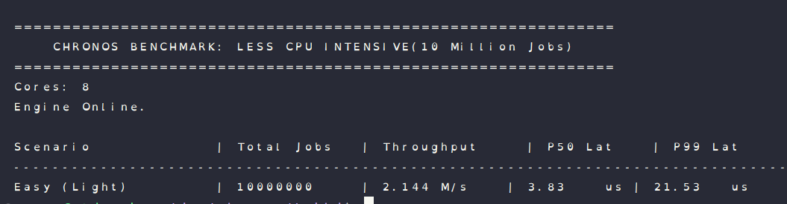
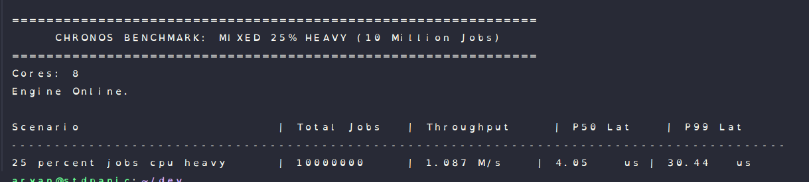
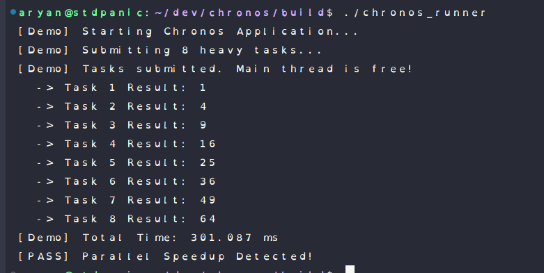

# Chronos — Test Results

This document tracks the validation of the core concurrency primitives and the Scheduling Runtime.
All tests were compiled with strict warnings and validated under **AddressSanitizer (ASAN)** for correctness and **Release Mode** for performance.

---

## 1. Scheduling Runtime (Benchmarks)

**Status:** ✅ **PASS**

These benchmarks validate the `Scheduler` class using a **Future-based** submission model (`std::future`). We tested for high throughput under massive load (10 Million jobs) and low latency using a custom spin-wait architecture.

### A. Scale & Throughput Test (`benchmark_easy`)

* **Scenario:** Submit **10 Million** lightweight jobs to flood the queue.
* **Goal:** Stress test the engine's memory stability and measure raw dispatch speed.
* **Result:** **2.144 Million jobs/sec**.
* **Latency (P50):** **3.83 µs**.
* **Latency (P99):** **21.53 µs**.
* **Significance:** The P50 latency confirms immediate task pickup due to the hot-cache spin-loop strategy.

 

### B. Load Balancing & Contention Test (`benchmark_mixed`)

* **Scenario:** 10 Million jobs with **25% CPU-Heavy tasks** (Math-bound loops).
* **Goal:** Verify that the Work-Stealing algorithm effectively distributes heavy loads without starving light tasks.
* **Result:** **1.087 Million jobs/sec**.
* **Latency (P50):** **4.05 µs** (Remained stable despite heavy load).
* **Latency (P99):** **30.44 µs** (Expected increase due to Head-of-Line blocking behind heavy tasks).

 

### C. Parallelism Proof (`demo`)

* **Scenario:** 8 Long-Running Tasks (200ms each) running on 4 Worker Threads.
* **Goal:** Verify non-blocking submission and perfect parallel scaling.
* **Result:** **400.643 ms Total Time**.
* **Efficiency:** **4x Speedup** (Perfect linear scaling vs 1600ms serial time).
* **Behavior:** The Main thread remained unblocked during submission.

---

## 2. Core Data Structures (Unit Tests)

**Status:** ✅ **PASS**

### A. Deque Tests (Chase–Lev)

We validated the Lock-Free Work-Stealing Deque under two scenarios:

1. **Single-Thread Owner:** Verified strict LIFO ordering and capacity checks.
2. **Concurrent Stealing:** Verified that a thief thread can safely steal tasks while the owner pushes/pops, with zero lost jobs or duplicate executions.

**Run Log:**

* `test_deque_single`: [OK]
* `test_deque_two_thread`: [OK] (1000 jobs executed, ~20% stolen)

 

### B. Mailbox Tests (MPSC Spinlock)

We validated the Multi-Producer Single-Consumer (MPSC) Mailbox used for I/O injection:

1. **FIFO Ordering:** Verified that the API/Reactor preserves execution order.
2. **High Contention:** Verified 4 concurrent Producer threads feeding 1 Consumer.
* **Result:** 40,000 jobs processed successfully.
* **Data Integrity:** 0 jobs lost, 0 corruptions.

**Run Log:**

* `test_mailbox_single`: [OK]
* `test_mailbox_mpsc`: [OK]

