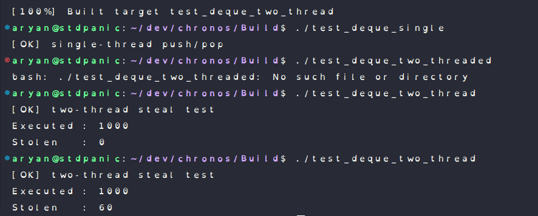

# Chronos — Test Results

This document tracks the current test coverage and results for Chronos.
At this stage, testing focuses on validating the correctness and safety of the
lock-free work-stealing deque (Chase–Lev design), which is the foundation of the scheduler.

---

## Deque Tests

All deque tests were compiled and run in **Debug mode** with strict compiler warnings enabled.
AddressSanitizer (ASAN) is supported and can be enabled via CMake.

### 1. Single-Thread Push/Pop Test

**Test:** `test_deque_single`  
**Purpose:**  
Validate basic correctness of the deque when used by a single owner thread.

**What is tested:**
- Push operations on the bottom
- Pop operations from the bottom
- Correct FIFO/LIFO behavior for the owner
- No underflow or overflow in normal operation

Status: **PASS**

---

### 2. Two-Thread Steal Test

**Test:** `test_deque_two_thread`  
**Purpose:**  
Validate correctness of concurrent stealing by a thief thread while the owner
executes jobs locally.

**What is tested:**
- Concurrent access to `top` and `bottom`
- Correct CAS behavior for steals
- No duplicate execution
- No lost jobs

Status: **PASS**

### Test Run Screenshot

A terminal capture of the successful test runs is included below:

