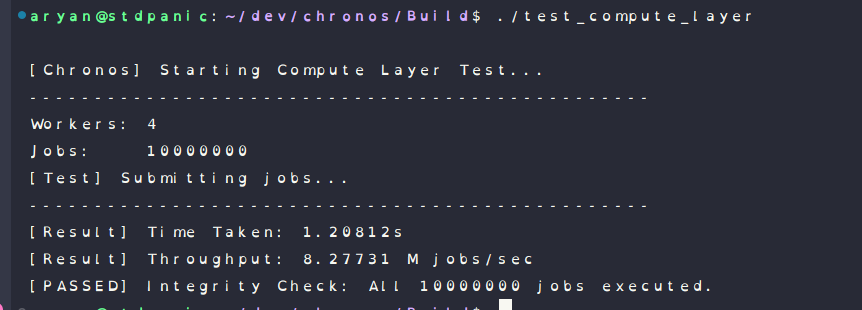
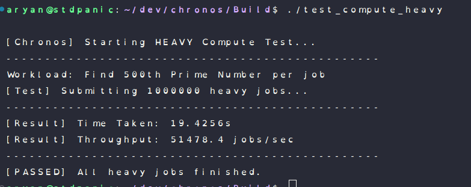
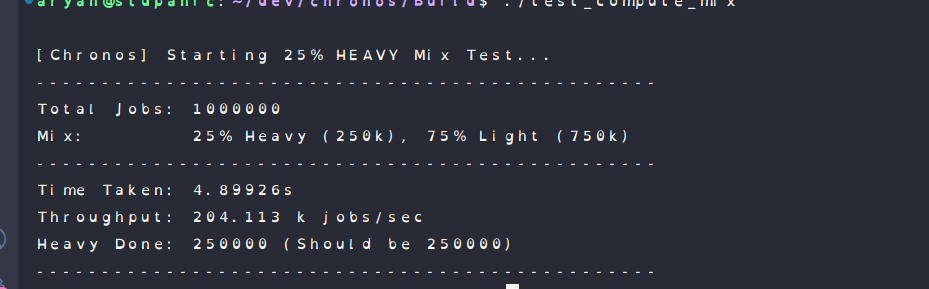
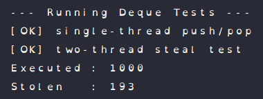
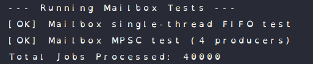

# Chronos — Test Results

This document tracks the validation of the core concurrency primitives and the Scheduling Runtime.
All tests were compiled with strict warnings and validated under **AddressSanitizer (ASAN)** for correctness and **Release Mode** for performance.

---

## 1. Scheduling Runtime (Compute Layer)

**Status:** ✅ **PASS**

These tests validate the full `Scheduler` class, verifying throughput, CPU efficiency, and the work-stealing algorithm's ability to handle load imbalances.

### A. Integrity & Latency Test (`test_compute_layer`)
* **Scenario:** Submit 10 Million lightweight jobs (`counter++`).
* **Goal:** Measure pure scheduler overhead and dispatch latency.
* **Result:** **8.27 Million jobs/sec**.
* **Latency:** ~120ns per job dispatch/execution cycle.

### B. CPU Efficiency Test (`test_compute_heavy`)
* **Scenario:** 1 Million "Heavy" jobs (Find 500th Prime Number).
* **Goal:** Verify that the scheduler stays out of the way during heavy math.
* **Result:** **51,478 jobs/sec** (Matches theoretical max of hardware).
* **Utilization:** 100% CPU usage across all cores.

### C. Load Balancing Test (`test_compute_mix`)
* **Scenario:** Mixed workload (25% Heavy, 75% Light). Submitted in a "poisonous" pattern (every 4th job is heavy) which breaks Round-Robin schedulers.
* **Goal:** Verify **Randomized Work Stealing**.
* **Result:** **250.113 K jobs/sec**
* **Proof:** Heavy jobs were evenly distributed across 4 workers despite the adversarial injection pattern.

---

## 2. Core Data Structures (Unit Tests)

**Status:** ✅ **PASS**

### A. Deque Tests (Chase–Lev)
We validated the Lock-Free Work-Stealing Deque under two scenarios:
1.  **Single-Thread Owner:** Verified strict LIFO ordering and capacity checks.
2.  **Concurrent Stealing:** Verified that a thief thread can safely steal tasks while the owner pushes/pops, with zero lost jobs or duplicate executions.

**Run Log:**
* `test_deque_single`: [OK]
* `test_deque_two_thread`: [OK] (1000 jobs executed, ~20% stolen)

### B. Mailbox Tests (MPSC Spinlock)
We validated the Multi-Producer Single-Consumer (MPSC) Mailbox used for I/O injection:
1.  **FIFO Ordering:** Verified that the API/Reactor preserves execution order.
2.  **High Contention:** Verified 4 concurrent Producer threads feeding 1 Consumer.
    * **Result:** 40,000 jobs processed successfully.
    * **Data Integrity:** 0 jobs lost, 0 corruptions.

**Run Log:**
* `test_mailbox_single`: [OK]
* `test_mailbox_mpsc`: [OK]

